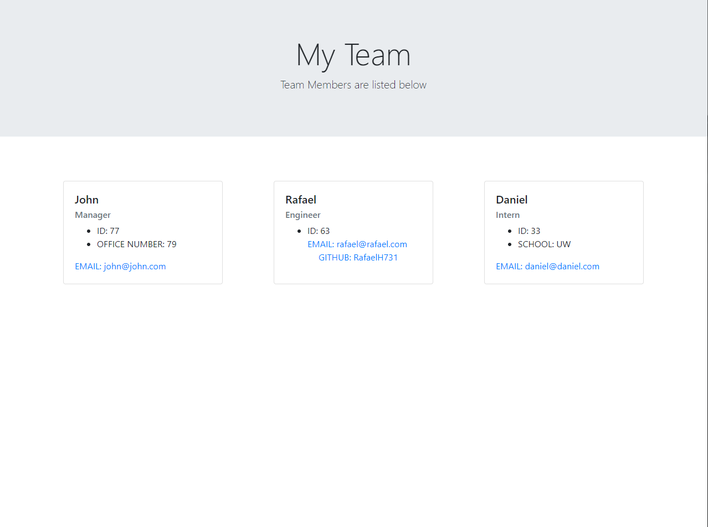
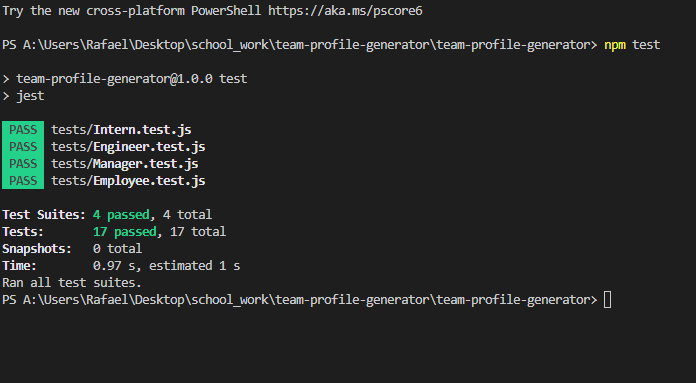
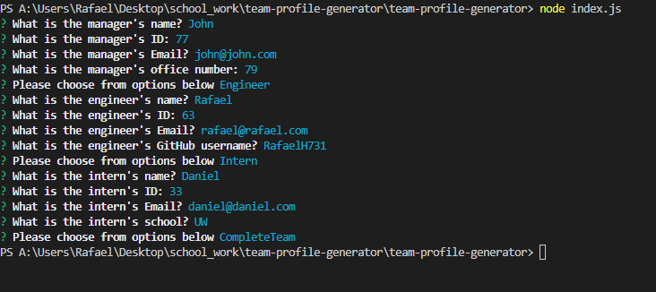

 ## Table of Contents
  - [Description](#description)
  - [Installation](#nstallation)
  - [Screenshots](#screenshots)
  - [Links](#links)
  
  ## Description
  The use of this application is to create a team profile. It uses inquierer to ask the user questions on the members it wants to add, manager, intern and engineer. It then will ask specific questions depending on the employee chosen. After that with the data gathered, an HTMl page will be generated and display all the employees added. 

  ## Installation
  This application uses inquierer so it must be installed before it can be run.
  Jest must also be installed in order to test the files in the lib folder.
  All depencies are in the code, run npm i to make sure all are installed before using the application.

  ## Screenshots
  - 
  - 
  - 

  ## Links
  - Youtube Link: https://youtu.be/-kWioszI96s
  - GitHub Repo Link: https://github.com/RafaelH731/team-profile-generator

